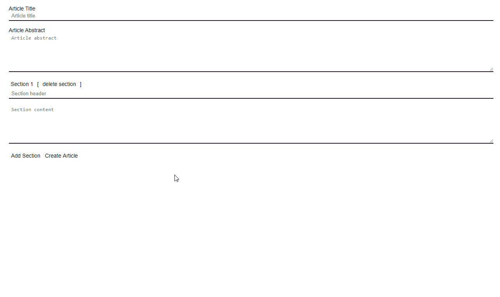
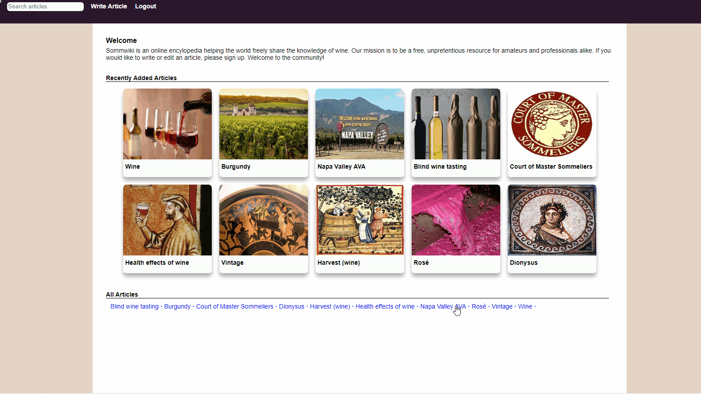
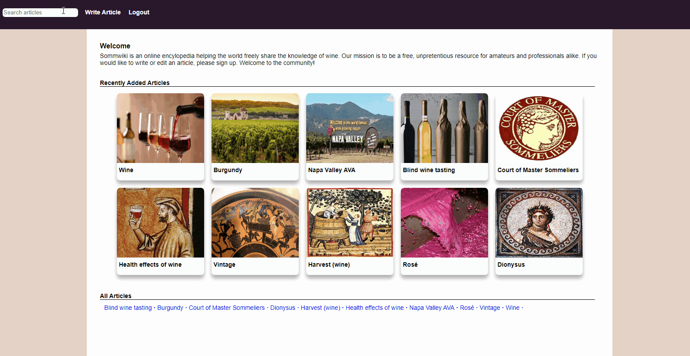

## Major Features
- [Features Overview](#Features-Overview)
- [Write Articles](#Write-Articles)
- [Edit Articles](#Edit-Articles)
- [Article Page](#Article-Page)
- [Cocktail Search](#Cocktail-Search)
- [User Authentication](#User-Authentication)
- [Future Features](#Future-features)

## Technologies
- React
- Redux
- Express
- Sequelize
- PostgreSQL
- Heroku

## Features Overview
***
Somm Wiki is an open source website for users to learn about the world of wine and share their own knowledge. Logged in users are able to write articles that are broken into sections and edit articles.

> Current Status: Ongoing Development

## Write Articles
***
Logged in users are able to write articles by section. By default the write article page contains an input fields for article title, article abstract and an empty section.

Sections are mapped out from the redux slice of state "sections". Clicking "Add Section" adds a new section to the slice of state and causes the page to render the new.



As a user types in any of the section fields, that section is updated in the redux store.

```bash
    case UPDATE_SECTION_CONTENT:
      copy = [...state]
      let header = copy[action.id].header
      copy[action.id] = {header, content:action.content}
      return copy
    case UPDATE_SECTION_HEADER:
      copy = [...state]
      let content = copy[action.id].content
      copy[action.id] = {content, header:action.header}
      return copy
```

When the article is submitted, the frontend sends an API call to the Express backend route `/api/articles/create`. This route creates a database entry in the articles table using the article title and article abstract. It then calls the `/api/articles/create/section` passing the newly created article id. This route maps over the sections, creating each one in the order they were in the redux store.

```bash
sections.map(async (section, idx) => {
  const orderNumber = (idx + 1)

  await Section.create({
      header:section.header,
      content:section.content,
      articleId:req.body.id,
      orderNumber
    })
})
```

## Edit Articles
***
Logged in users are able to edit articles by clicking "edit" at the bottom of an articles page. Clicking edit redirects the user to "/articles/{articleid}/edit". This page takes the current article (loaded when the user navigates to an article, see [Article Page](#Article-Page)) in redux and renders the title, abstract, and sections as input and textarea fields instead of `<pre></pre>` elements.




A user is able to delete sections by clicking delete which removes the section from the redux slice of state.

As a user changes the text in any of the fields, the corresponding redux state is changed using the same logic from [write articles](#Write-Articles). When the user clicks "Update Article" the frontend first makes a call to express backend route "/api/articles/sections/update". This route first finds the previous sections and then updates each. It then checks if see if there were more sections then submitted sections and removes any extras.

```bash
  sections.map(async (section, idx) => {
    const orderNumber = (idx + 1)
    const sec = await Section.findOne( {where:{ orderNumber, articleId } } )

    if(!!sec) {
      sec.content = section.content;
      sec.header = section.header;
      sec.orderNumber = orderNumber

      sec.save();
    } else {

      await Section.create({
        header:section.header,
        content: section.content,
        articleId,
        orderNumber
      })
    }
  })

  if(allOldSections.length > sections.length) {
  const difference = allOldSections.length - sections.length
  let i = (allOldSections.length-1)

  while(difference > 0) {
    await allOldSections[i].destroy();
    i--
    difference--
  }
```

The updated sections are sent back to the frontend, updated in redux and then remapped.

## Article Page
***
When a user navigates to an article the frontend makes an API call to the Express route "/api/articles/${id}" which queries the PostgreSQL database through Sequelize and returns all of the articles information. The frontend then puts the information into the "articles/current" slice of redux state.

```bash
router.get("/:id", asyncHandler(async (req, res, next) => {
  const article = await Article.findOne({where:{id:req.params.id}, include: Section})
  res.json({article:article});
}));

```
The information from the "articles/current" slice of redux state is mapped over to display the information.

The table of contents is dynamically generated based off of the mapping of the redux slice of state "articles/current/sections". Each table of content input is displayed based off of the section's orderNumber.


## Article Search
***
Users are able to type a search term and find relevant articles using the navigation's search bar. The search bar is its own react component using regex to match results and account for trailing white space.



The regex function first ensures any reserved regex character is escaped to ensure they are included in the search.

```bash
    function escapeRegExp(s) {
      return s.replace(/[-/\\^$*+?.()|[\]{}]/g, "\\$&");
    }
    #...more code
```

The query is then split into individual words based off of white space.

```bash
    #... more code
    const words = q
      .split(/\s+/g)
      .map(s => s.trim())
      .filter(s => !!s);
    #... more code
```

Each word is then made into regex. If the word does not have white space it is wrapped in a word boundary `\\bword\\b` otherwise only the beginning of the word is set as a boundary and the rest remains `\\bword`. In either result a positive look ahead `?=.*` is added to allow for the word to be any part of the query. The expression is also passed the 'i' argument to make the words case insensitive.

All possible article titles are then filtered using the above regex.test() assertion to see if the title could match.

```bash
    #... more code
    return list.filter(item => {
      return searchRegex.test(item.title);
    });
```
## User Authentication
***
A user is able to view and search articles without logging in. To write or edit articles they must log in. The navigation bar changes to reflect the user's authentication.

A user without an account can sign up by navigating to "/signup". The information in the signup form is kept track of through react useState hooks and on submit sends a fetch call with the information to the Express backend route "/api/auth/signup".

This route first validates the data. If everything validates then the password is first hashed using Bcrypt hashing algorithm and then a user object is created using Sequelize to save them to the PostgreSQL database. Using the generated user object, a JSON web token is created and the tokenId is added to the user object. The user is then saved to the PostgreSQL database.

```bash
const user = await User.create({
      firstName,
      lastName,
      username:userName,
      email,
      hashedPassword
    });

    const { jti, token } = generateToken(user);

    user.tokenId = jti;

    await user.save();
```

The token is then set as a cookie named "token" and the user information is sent back without the password. The user information is put into the redux slice of state "authentication"

The authentication of the user is persisted until they log out and the default state of the authentication slice of state is loaded by checking for the JSON web token cookie. If the token exists the information is taken off of it and loaded into redux.

```bash
function loadUser() {
  const authToken = Cookies.get("token");
  if (authToken) {
    try {
      const payload = authToken.split(".")[1];

      const decodedPayload = atob(payload);

      const payloadObj = JSON.parse(decodedPayload);
      const { data } = payloadObj;
      return data;
    } catch (e) {
      Cookies.remove("token");
    }
  }
  return {};
}
```

To login, the user submits their information to the Express route "/api/auth/login" which checks if a matching user exists in the database and if the provided password matches the hashed password in the database. If a user is found and the password matches it generates a JSON web token and sets it as a cookie called "token". The user object from the database is sent to the frontend without the password where it is put into the "authentication" slice of redux state.

```bash
    const user = await User.findOne({ where: { email } });

    if(!user) {
      const err = new Error('Login failed');
      err.status = 404;
      err.title = 'Login failed';
      err.errors = ['No user with provided email found'];
      return next(err);
    }

    const isValidPassword = bcrypt.compareSync(password, user.hashedPassword.toString())

    if (!isValidPassword ) {
      const err = new Error('Login failed');
      err.status = 401;
      err.title = 'Login failed';
      err.errors = ['Invalid credentials'];
      return next(err);
    }

    const { jti, token } = generateToken(user);
    user.tokenId = jti;
    await user.save();

    res.cookie('token', token);
    res.json({ token, user: user.toSafeObject()});
```

When a user clicks "Logout" it deletes the JSON web token and sends an empty user object to the redux slice of state "authentication".


## Future Features
***

## Editors Page
As development continues the website will be refactored to prevent users from directly writing, editing, and deleting articles or sections without an "editors" approval. Users will still be able to access the above features in the same way, but the updated article will be saved to the database with a status of "under review".

The Users table will be modified to have a role, defaulting to "user". Users with the role "editor" will be able to view "under review" articles and changes on a backend page that only they have access to. The editor can decide to reject the changes or to modify them for accuracy.

## Images
***
As development continues, users will be able to submit images to be included in the articles. This will be set up with AWS S3 buckets.

## Same Page Editing
***
Allow users to edit just one section of an article as they read without redirecting to the full edit page.

## Known Bug Log
***
- Editing an articles title or abstract does not update the article.

- Search results Images

- User Validation errors on sign up and log in.
